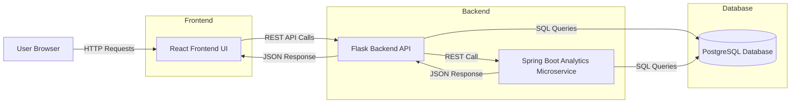
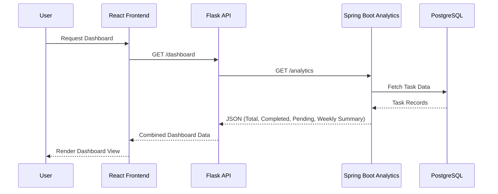
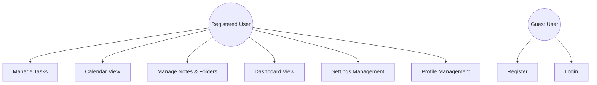
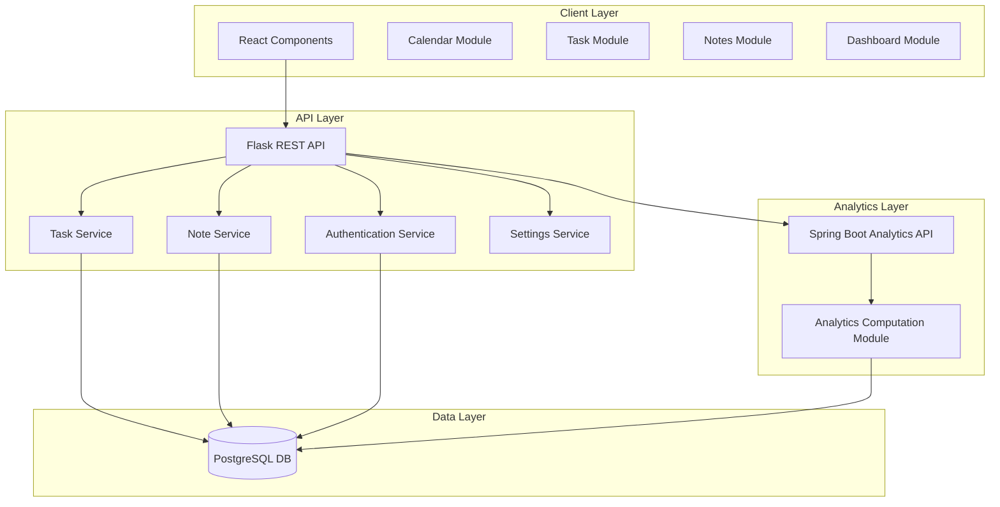
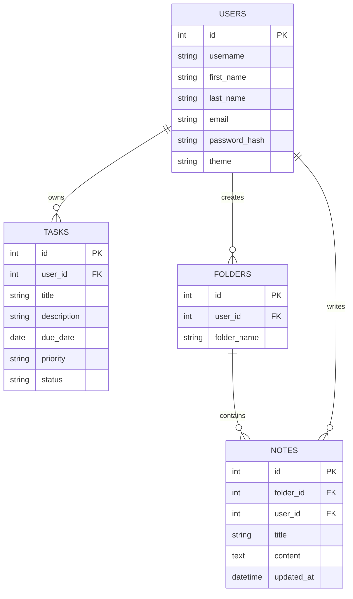
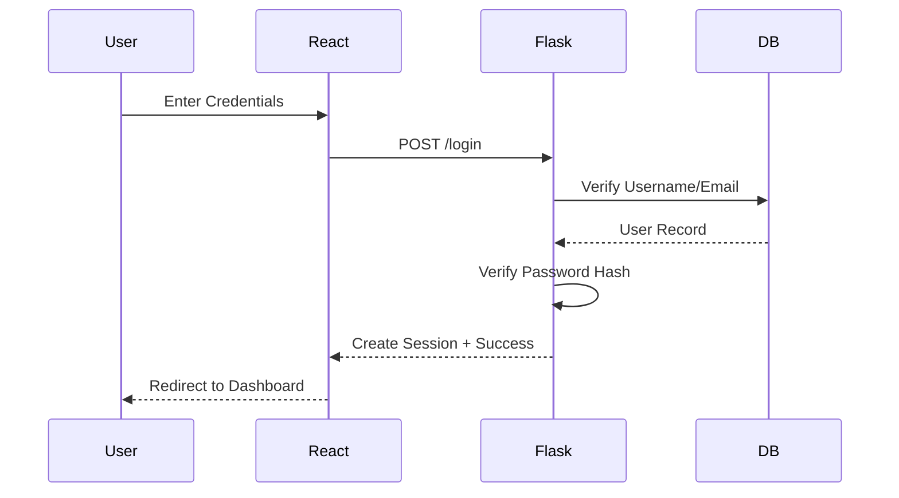
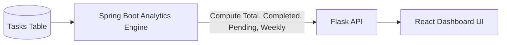
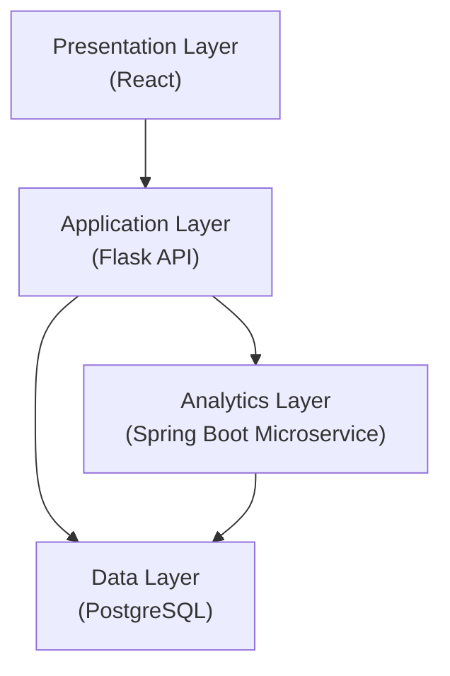

<h1 align="center">🚀 SYSTEM DESIGN</h1>   

# 🏗 1. High-Level System Architecture Diagram

# 🔄 2. Microservice Interaction Diagram

# 👤 3. Use Case Diagram

# 🧩 4. Component Diagram

# 🗄 5. ER Diagram (Database Design)

# 🔐 6. Authentication Flow Diagram

# 📊 7. Dashboard Analytics Flow

# 🧠 8. Logical Layered Architecture

