<h1 align="center">🚀 SYSTEM DESIGN (At a Glance)</h1> <br> 


# TOC

<details>
<summary>TABLE OF CONTENTS</summary>

- [🚀 SYSTEM DESIGN (At a Glance)](#-system-design-at-a-glance)

### 🏗 System Architecture
- [🏗 1. High-Level System Architecture Diagram](#-1-high-level-system-architecture-diagram)
- [🔄 2. Microservice Interaction Diagram](#-2-microservice-interaction-diagram)
- [👤 3. Use Case Diagram](#-3-use-case-diagram)
- [🧩 4. Component Diagram](#-4-component-diagram)
- [🗄 5. ER Diagram (Database Design)](#-5-er-diagram-database-design)
- [🔐 6. Authentication Flow Diagram](#-6-authentication-flow-diagram)
- [📊 7. Dashboard Analytics Flow](#-7-dashboard-analytics-flow)
- [🧠 8. Logical Layered Architecture](#-8-logical-layered-architecture)

### 🚀 SYSTEM DESIGN - DETAILED

#### 🔄 Sequence Diagrams
- [User Management](#sequence-diagrams)
  - [Registration](#registration-fr-um-1-fr-um-2-fr-um-3)
  - [Login](#login-fr-um-4-fr-um-5)
  - [Logout](#logout-fr-um-6)

- [Task Management](#task-management)
  - [Create Task](#create-task-fr-tm-1)
  - [View Tasks](#view-tasks-fr-tm-2-fr-tm-5)
  - [Update Task](#update-task-fr-tm-3)
  - [Delete Task](#delete-task-fr-tm-4)

- [Notes & Folder Management](#notes--folder-management)
  - [Create Folder](#create-folder-fr-fld-1)
  - [Create Note](#create-note-fr-note-1)
  - [Auto-Save Note](#auto-save-note-fr-note-3)

- [Dashboard & Analytics](#dashboard--analytics)
  - [Dashboard Load](#dashboard-load-fr-dash-1-to-fr-dash-4-fr-an-1-to-fr-an-5)


### 📊 Data Flow Diagrams (DFD)
- [DFD Level 0 - Context Diagram](#dfd-level-0---context-diagram)
- [DFD Level 1 - Major System Processes](#dfd-level-1---major-system-processes)

#### DFD Level 2
- [User Management](#dfd-level-2---user-management)
- [Task Management](#dfd-level-2---task-management)
- [Calendar Management](#dfd-level-2---calendar-management)
- [Notes & Folder Management](#dfd-level-2---notes--folder-management)
- [Dashboard & Analytics](#dfd-level-2---dashboard--analytics)

#### DFD Level 3
- [Microservice Analytics](#dfd-level-3---microservice-analytics)

</details>

---
# 🏗 1. High-Level System Architecture Diagram

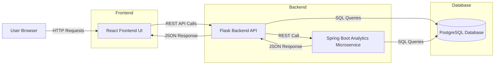


# 🔄 2. Microservice Interaction Diagram

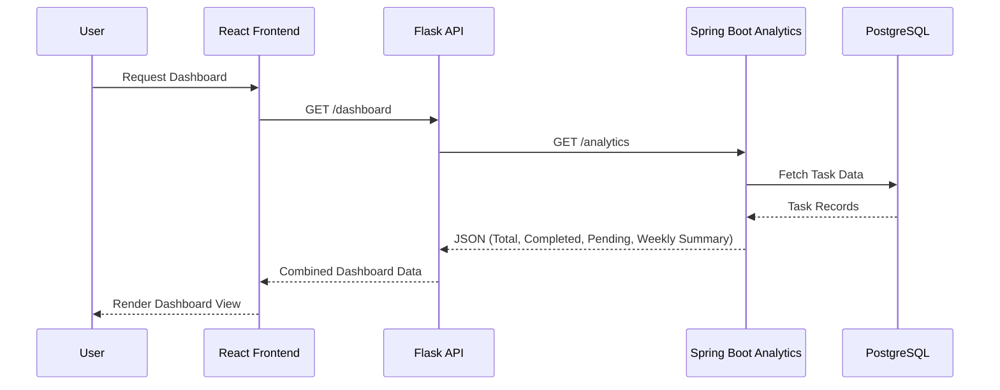


# 👤 3. Use Case Diagram

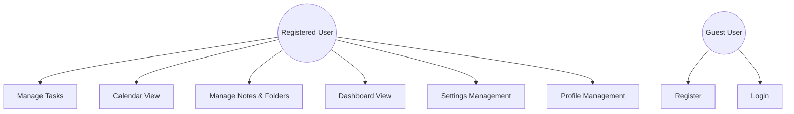


# 🧩 4. Component Diagram

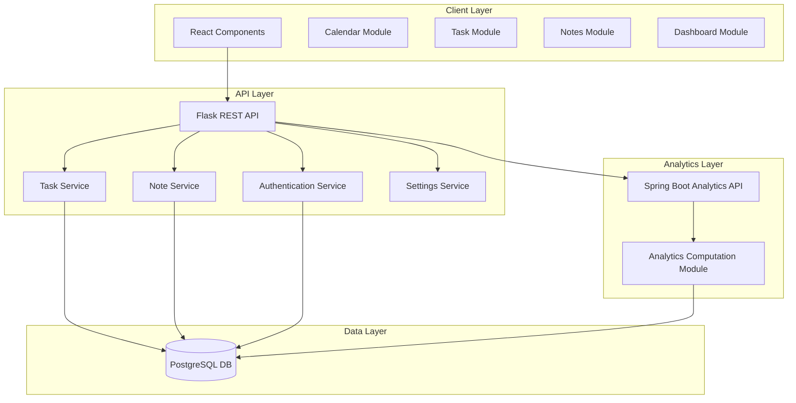


# 🗄 5. ER Diagram (Database Design)

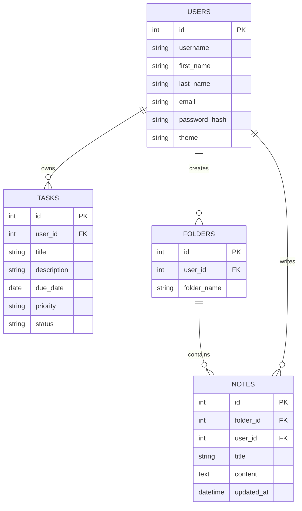


# 🔐 6. Authentication Flow Diagram

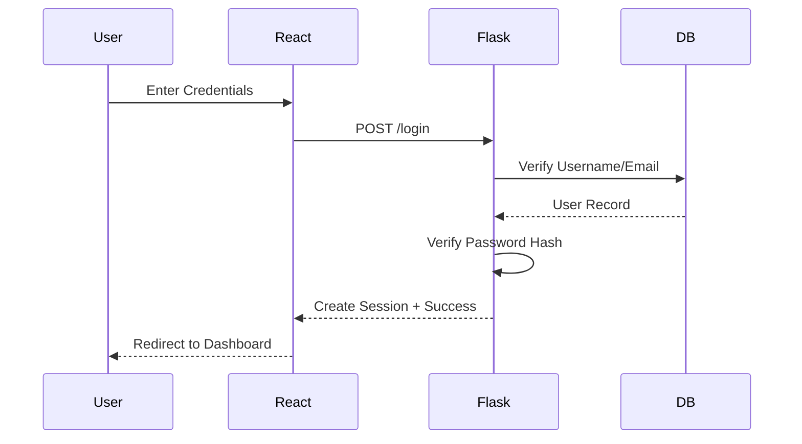


# 📊 7. Dashboard Analytics Flow

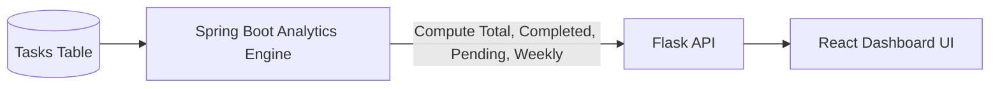


# 🧠 8. Logical Layered Architecture

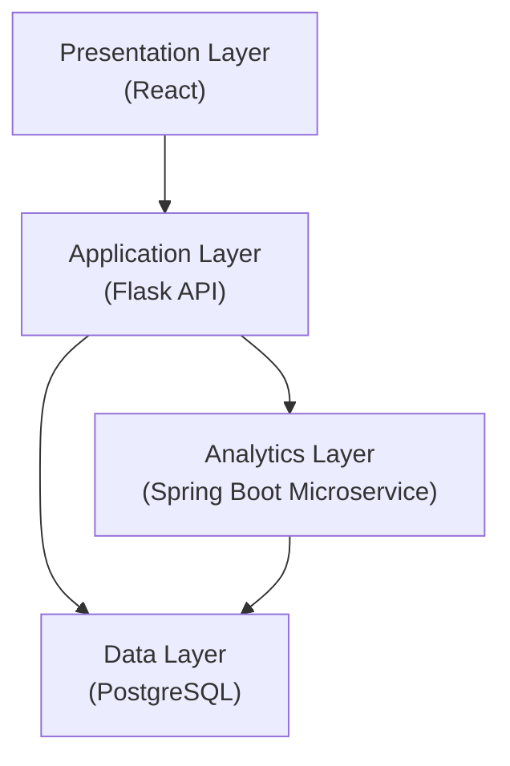

# 🚀 SYSTEM DESIGN - DETAILED

## SEQUENCE DIAGRAMS 
### User Management
#### Registration (FR-UM-1, FR-UM-2, FR-UM-3)

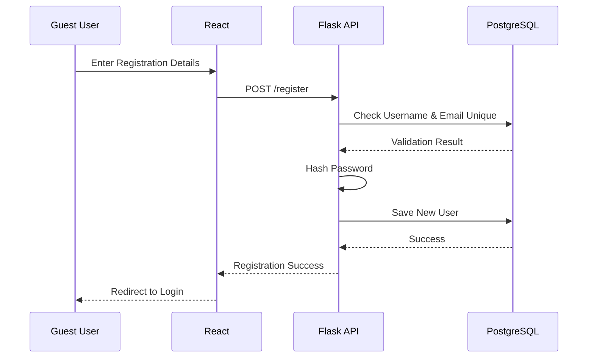

#### Login (FR-UM-4, FR-UM-5)

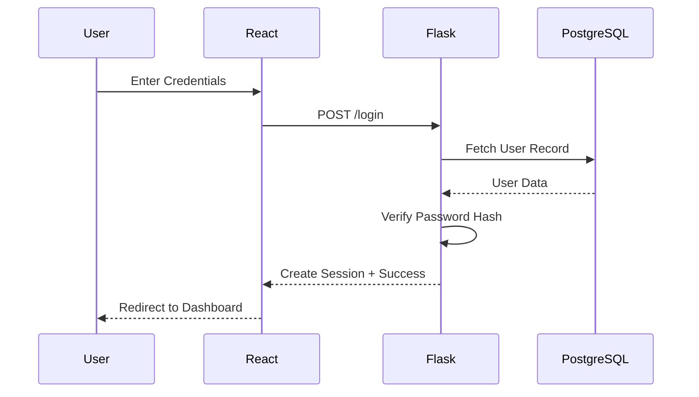


####  Logout (FR-UM-6)

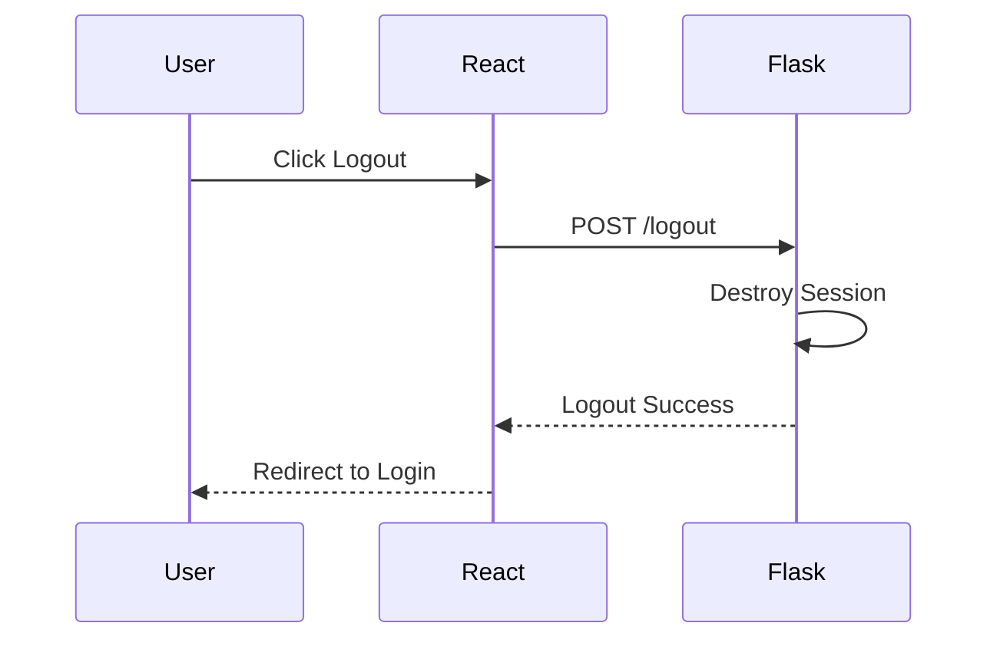


### Task Management

#### Create Task (FR-TM-1)

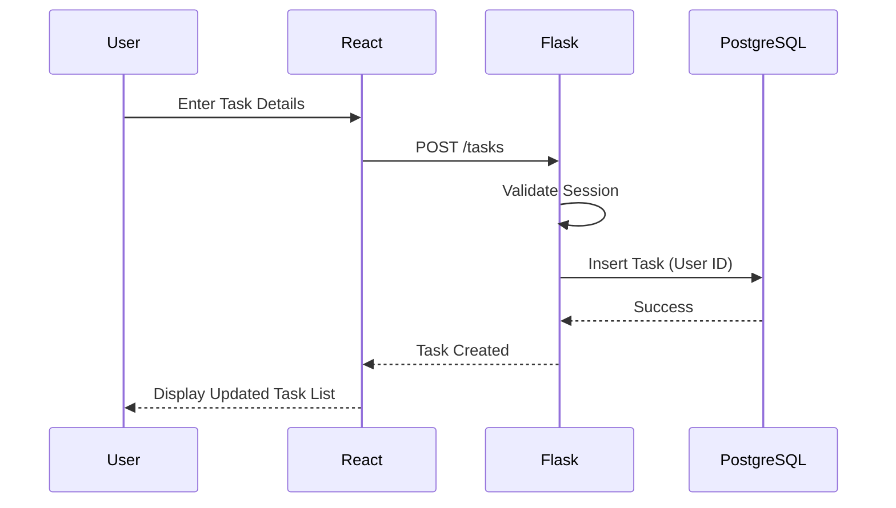


#### View Tasks (FR-TM-2, FR-TM-5)

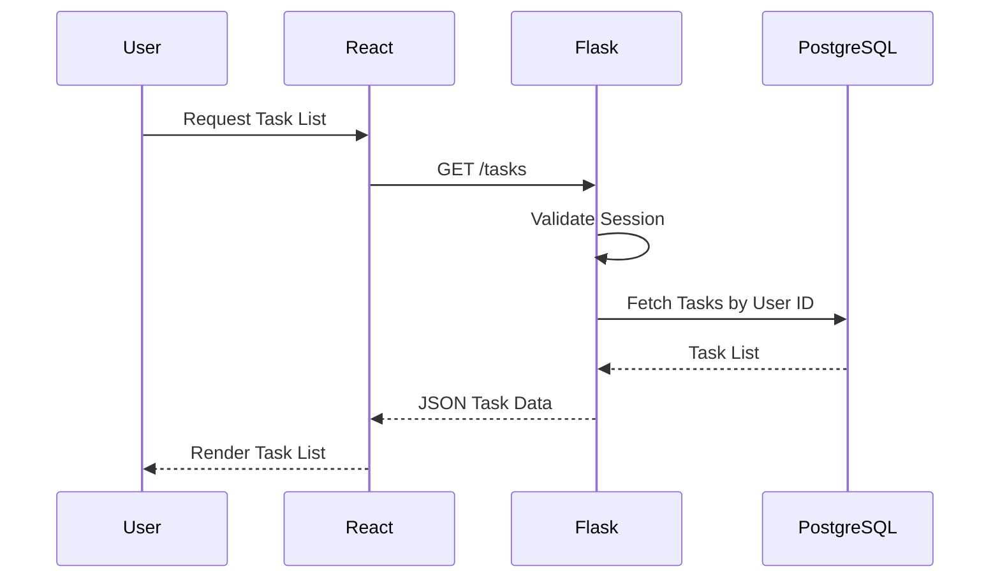

#### Update Task (FR-TM-3)

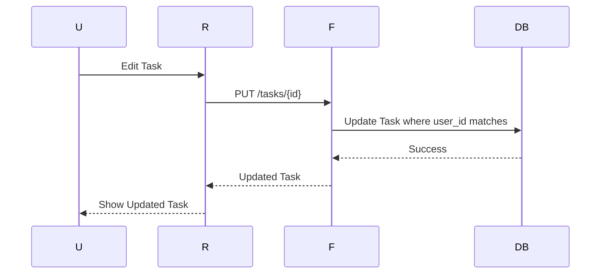


#### Delete Task (FR-TM-4)

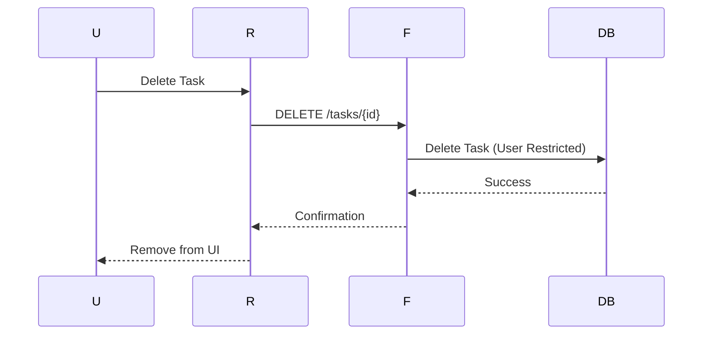


### Notes & Folder Management
####  Create Folder (FR-FLD-1)

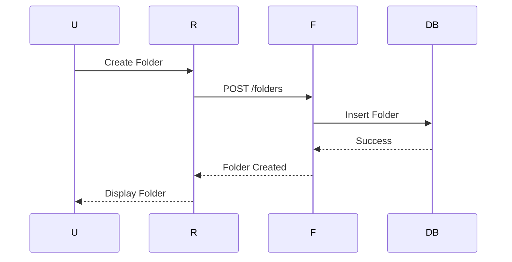


#### Create Note (FR-NOTE-1)

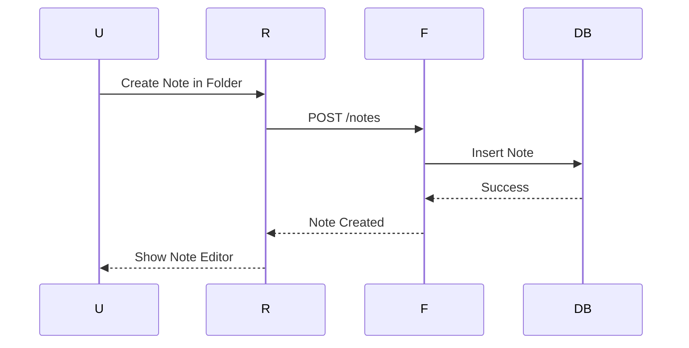

#### Auto-Save Note (FR-NOTE-3)

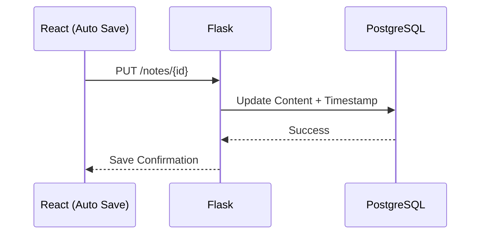

### Dashboard & Analytics
#### Dashboard Load (FR-DASH-1 to FR-DASH-4, FR-AN-1 to FR-AN-5)

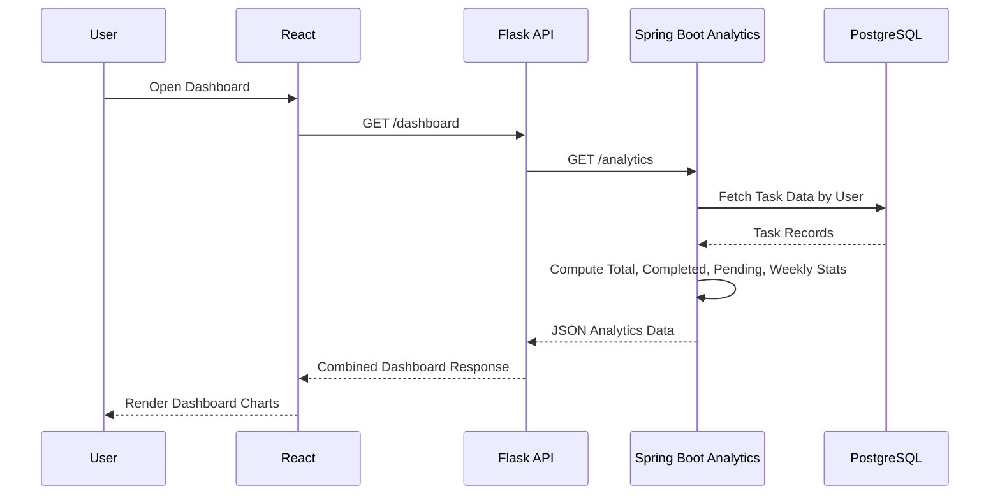


## Data Flow Diagram (DFD)
### DFD Level 0 - Context Diagram

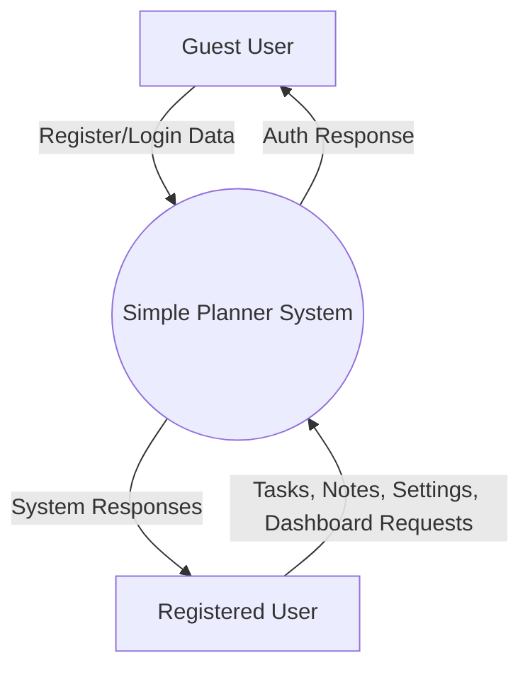

### DFD Level 1 - Major System Processes

```mermaid
flowchart TB

    %% External Entities
    Guest[Guest User]
    User[Registered User]

    %% Processes
    P1((User Management))
    P2((Task Management))
    P3((Calendar Management))
    P4((Notes & Folder Management))
    P5((Settings Management))
    P6((Dashboard & Analytics))

    %% Data Stores
    D1[(Users DB)]
    D2[(Tasks DB)]
    D3[(Folders DB)]
    D4[(Notes DB)]

    %% Guest Interactions
    Guest --> P1
    P1 --> Guest

    %% User Interactions
    User --> P2
    User --> P3
    User --> P4
    User --> P5
    User --> P6

    P2 --> User
    P3 --> User
    P4 --> User
    P5 --> User
    P6 --> User

    %% Data Store Connections
    P1 --> D1
    P2 --> D2
    P3 --> D2
    P4 --> D3
    P4 --> D4
    P5 --> D1
    P6 --> D2

```

### DFD LEVEL 2 - User Management

```mermaid
flowchart TB

    Guest[Guest/User]

    P11((Register))
    P12((Login))
    P13((Logout))
    P14((Update Profile))

    D1[(Users DB)]

    Guest --> P11
    Guest --> P12
    Guest --> P13
    Guest --> P14

    P11 --> D1
    P12 --> D1
    P14 --> D1

```


### DFD LEVEL 2 - Task Management 

```mermaid
flowchart TB

    User[Registered User]

    P21((Create Task))
    P22((View Tasks))
    P23((Update Task))
    P24((Delete Task))
    P25((Filter Task))

    D2[(Tasks DB)]

    User --> P21
    User --> P22
    User --> P23
    User --> P24
    User --> P25

    P21 --> D2
    P22 --> D2
    P23 --> D2
    P24 --> D2
    P25 --> D2

```


### DFD LEVEL 2 - Calendar Management


```mermaid
flowchart TB

    User[Registered User]

    P31((View Calendar))
    P32((Create Task via Calendar))
    P33((Edit Task via Calendar))
    P34((Delete Task via Calendar))

    D2[(Tasks DB)]

    User --> P31
    User --> P32
    User --> P33
    User --> P34

    P31 --> D2
    P32 --> D2
    P33 --> D2
    P34 --> D2

```


### DFD LEVEL 2 - Notes & Folder Management 

```mermaid
flowchart TB

    User[Registered User]

    P41((Create Folder))
    P42((Rename Folder))
    P43((Delete Folder))
    P44((Create Note))
    P45((Edit Note))
    P46((Auto Save Note))
    P47((Delete Note))
    P48((Retrieve Notes by Folder))

    D3[(Folders DB)]
    D4[(Notes DB)]

    User --> P41
    User --> P42
    User --> P43
    User --> P44
    User --> P45
    User --> P46
    User --> P47
    User --> P48

    P41 --> D3
    P42 --> D3
    P43 --> D3
    P44 --> D4
    P45 --> D4
    P46 --> D4
    P47 --> D4
    P48 --> D4

```

### DFD LEVEL 2 - Dashboard & Analytics

```mermaid
flowchart TB

    User[Registered User]

    P61((Request Dashboard))
    P62((Compute Analytics - Spring Boot))
    P63((Return Statistics))

    D2[(Tasks DB)]

    User --> P61
    P61 --> P62
    P62 --> D2
    D2 --> P62
    P62 --> P63
    P63 --> User

```


### DFD LEVEL 3 - Microservice Analytics


```mermaid
flowchart TB

    P62((Compute Analytics))

    P621((Fetch User Tasks))
    P622((Calculate Total Tasks))
    P623((Calculate Completed Tasks))
    P624((Calculate Pending Tasks))
    P625((Calculate Weekly Summary))
    P626((Generate JSON Response))

    D2[(Tasks DB)]

    P62 --> P621
    P621 --> D2
    D2 --> P621

    P621 --> P622
    P621 --> P623
    P621 --> P624
    P621 --> P625

    P622 --> P626
    P623 --> P626
    P624 --> P626
    P625 --> P626

```

